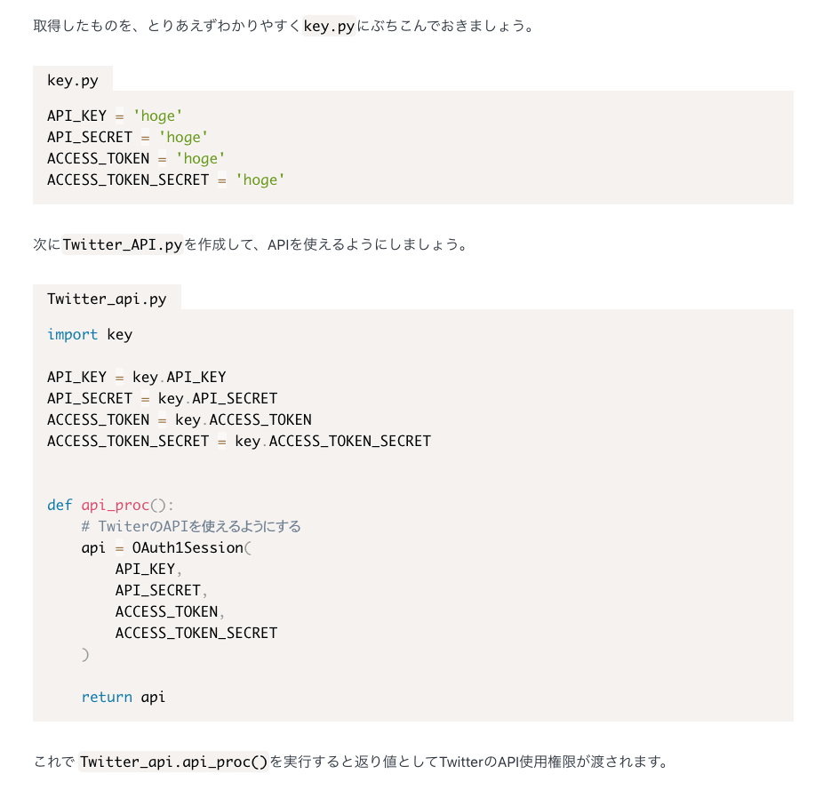

## Gatsby 上でシンタックスハイライトをきかせる

`gatsby-starter-blog`を使用している場合、
余計な設定は不要で使用可能。
`4.`,`5.` だけ読んどいたほうがいいかも。

### 1. 以下のモジュールをインストールする

- `prismjs`
- `gatsby-remark-prismjs`
- `gatsby-remark-prismjs-title`

```sh:title=terminal
npm install -S prismjs gatsby-remark-prismjs gatsby-remark-prismjs-title
```

### 2. `gatsby-config.js`の書き換え

※ `gatsby-starter-blog`を使用しているのでこの手順はスキップ可能。

```js:title=gatsby-config.js
resolve: `gatsby-transformer-remark`,
options: {
  plugins: [
    `gatsby-remark-prismjs-title`,
    `gatsby-remark-prismjs`,
  ]
},
```

### 3. `gatsby-browser.js`の書き換え

[Prism](https://prismjs.com/) を参考に好きなテーマで設定します。

例えばデフォルトなら、

```js:title=gatsby-browser.js
// Highlighting for code blocks
import "prismjs/themes/prism.css"
```

例えば`Tomorrownight`を適用させたいなら、

```js:title=gatsby-browser.js
// Highlighting for code blocks
import "prismjs/themes/prism-tomorrow.css"
```

みたいな感じです。

### 4. ハイライトにタイトルをつける

ここまで正常に設定できていると、

これが

````markdown
```python :aiueo

```
````

`gatsby develop` するとこうなります。

```html
<div class="gatsby-code-title">
  <span>aiueo</span>
</div>
```

これに対してスタイルシートを設定していきます。
なんでもいいので`import`している CSS を書き換えます。
今回は、`style.css`に全部ぶち込んでいるのでここに書きます。

ここはテーマに合わせて好きなように書き換えましょう。

```css:title=style.css
.gatsby-code-title {
  background: #F5F2F0;
  color: #000;
  font-family: Consolas, Monaco, "Andale Mono", "Ubuntu Mono", monospace;
  margin: 20px 0px -24px;
  padding: 8px 1rem 20px;
  font: size 1em;
  line-height: 1;
  display: table;
}

```

### 5. 記事がハイライトされ…ないときの Tips

Q. ここまでちゃんと設定したはずなのにシンタックスハイライトが効きません…

A. Markdown の書き方がおかしい可能性があります。

例えば、

```markdown:title=index.md
python :aiueo
```

ではタイトルもつかないしシンタックスハイライトもつかないので

```markdown:title=index.md
python:title=aiueo
```

とする。  
**ハイライトしたい言語のあとにスペースを挿入しない**のがコツ。

### できあがり



参考

> [GatsbyJS で作っているブログでシンタックスハイライトが適用されるようにした \| キクナントカドットコム](https://kikunantoka.com/2019/12/03--install-syntax-highlight/)  
> [GatsbyJS ブログのコードブロックにタイトルと指定行のハイライトを追加した \| のふのふろぐ](https://rpf-noblog.com/2020-05-02/gatsby-code-title-highlight/)
