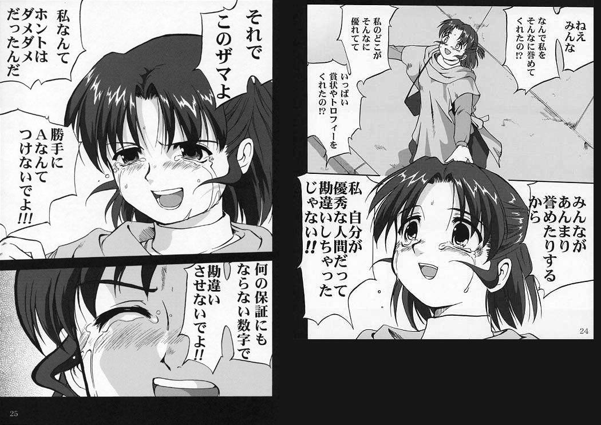

勝手に一晩泣きじゃくっていろいろ考えていた、

### ある会社と面接をして、勝手に傷ついた失礼な男の話。

アルモノを作る人の一部になろうとしてるのに、  
**「それを作る人を意識してない」のはとても失礼な事**だなということ、  
そこの虚を突かれて**身勝手に「自分の好きを否定されてしまった」と思い込んで自己嫌悪に陥った**こと、  
**実は否定なんてされてなくて、そこは単純にお前が甘かっただけだよね**って話。  
(これについて Twitter で存在意義を失った、死にたいとか言ってたら心配のリプが届いて申し訳なくなった)

マザコンなので母親にそういった事があった、と泣きつくと、  
給料がやっすい契約社員の事務員に、個人レベルで名前も覚えて尊敬する、そこまで求めるの？  
新潟ならまだわかる価格だけど、東京だろ？それで過ごしていけるの？無理だろ…  
仮にそこ答えられたとしても、その会社にその人はいないわけじゃん？ウチ以外でもいいよね？って話にならないの？  
給料以外やってみたい仕事って言ってたのに面接でそんな事言われてたら、  
**働いたらボコボコにされておしまいじゃね？**  
…という話をもらって、すげえ自己中心的だけどそうだなってなった。

### 就職がうまく行かないのはなんでなんでしょうねの話。

就活続けてるけど働けない理由を考える。  
分野別で言われたことイコール事実をもとに考えた。

- 好きなデザインの仕事をするには**技術が足りない**と言わる。

自分が好きなパーツしか作れない、経験なしで 30 近い地方のペーペーに月額 20 万払うのは  
結構なリスクだとは思う、じゃあ趣味で作っててね〜って話。  
一応美大を出てこのザマなので、美大を出たというクソみたいなプライドがここの勝負を諦めさせてくれない。  
本心はそんなプライドどうでもよくて、何百万も払って出た学校を無下にしたくないという  
出ていった金に対する、ギャンブル依存症のような後の戻れなさが枷になっている。
知ってるか、それがプライドっていうんだぜ。

- そうでもない事務の仕事をするには、分野に対するリスペクトが足りないと言われ、

前述の通り、これは本当に甘えた話だし失礼な話

- エンジニアの仕事をするには経験も技術も何もかも足りねえよお前と言われ、

基礎もわからずスクールにも通ってない、  
小さい会社でﾌﾟﾛｸﾞﾗﾐﾝｸﾞﾁｮｯﾄﾃﾞｷﾙﾏﾝしてた経験だけで勝負できる世界じゃない。  
おとなしくクラウドソーシングでもしてな、と指摘を受けた、  
ごもっともだと思う、なんで俺エンジニアに勝負かけてるんだろう？

- アルバイトをするにも就活ですぐに消えねえかお前？と言われ、
  働きたい気持ちはわかるんだけど、  
  お前はここでアルバイトするよりしたいことがあるんじゃないのか？と言われている。  
  なんか知らないけどここでも自分の好きを持ち出されて、それを突き詰めていったら？と。

### 一番やりたいことは何？

**「結局、お前が好きで好きで、やりたくて仕方がないこと、それはなんなの？」** と問われることが最近本当に多い。  
突き詰めると、**「自分で何かを作り出すこと」がそうなんだ**と思えるんだけど、  
**それで金を稼ぐには全然未熟**、金が無いとインプットもアウトプットも満足にできない、  
だから別の選択肢を採りたいから就職活動しているんだ、と自分では思っている。

ところで、なんでお前クリエイター目指しているの？という話だけれども、  
単純になにかを作り出すのが好きで、それに対してお金や時間をかけてきたから、だと思う。  
根本は落書きや鼻歌が楽しいと思っていて、それが積もり積もって、という感じ。  
それを褒められたりするのが嬉しくてどんどん前に進んでいったけれど、

こういった感じで自己嫌悪に陥っている。  
周りは認めてくれるけど、それ以外は…って感じ。

余談だけど、前 Twitter で **「クリエイターとかアーティストって言葉が嫌い、誰かを括ることが嫌いなのかもしれない、個人で捉えたい」** といっている人がいて、ご尤もだと思った。

### 結局

就活はまだ続く。  
面接を経るたびにの詰めが甘いなと思うので、そこはちゃんと詰めていきたい。  
就活が終活にならないようにだけ気をつけよう。

死にたいけど、しぶとく生きてしまうんだろう、死なない限りはちゃんと発信していきたい。  
不器用なのでそれしかできない、早く歌を届けたいし、頭の中のものを届けたい。

頑張って生きます、死なない程度に落ち込みます。

元気がない時はヒカキンとかそのへんの動画が効くことがわかった、  
全部何もかも忘れられるので。  
ニコニコでよく淫夢の動画に見る抗うつ剤とかタグがついていて、今思うとそのとおりだなって感じだ。

これはヒカキンじゃなくてセイキンだけどよく見てる。

<iframe width="1264" height="720" src="https://www.youtube.com/embed/bvhgevKdn38" title="YouTube video player" frameborder="0" allow="accelerometer; autoplay; clipboard-write; encrypted-media; gyroscope; picture-in-picture" allowfullscreen></iframe>
