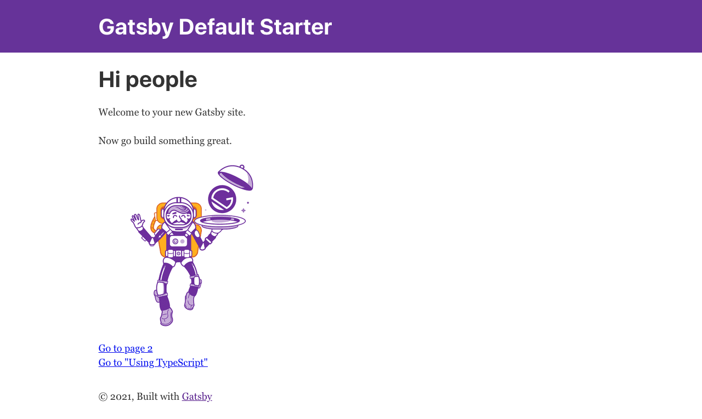
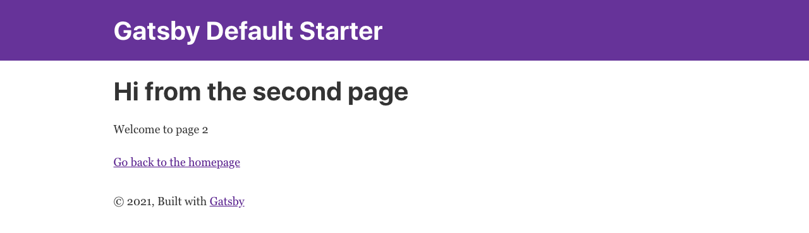
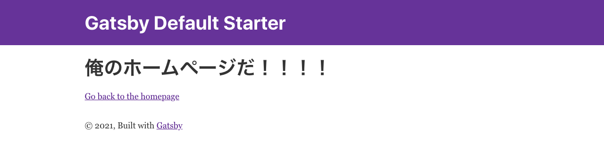

# この記事でやること

- 試しに`gatsby-starter`を導入する
- ローカル上にホームページを公開する
- `Visual Studio code`を導入する
- `gatsby-starter`をいじってみる

この記事は[【Gatsby】JS 歴ゼロ秒から始める、ポートフォリオサイト構築](../gtb-portforio)の続きです。
理解が追いつかなかったらこちらも合わせてどうぞ。

## Gatsby のスターターを見てみよう

`Gatsby`には`Starter`という便利なものがあります。  
カードゲームでもよくありますよね、スターターパック。  
ニュアンスとしては似たような感じで捉えて良いと思います。

## 試しに`gatsby-starter`を導入してみる

1. とりあえず、一番基礎的なスターターである  
   `gatsby-starter-default`を導入してみましょう。  
   ターミナルで、どこでもいいのでわかりやすい場所に移動します。  
   じゃあとりあえず、デスクトップにしましょうか。

2. [gatsby\-starter\-default: Gatsby Starter \| Gatsby](https://www.gatsbyjs.com/starters/gatsbyjs/gatsby-starter-default/)  
   に`Install this starter locally:`とありますので、  
   そこにあるコマンドをターミナルにコピペします。

```zsh

# 1.
# 任意のパス
$ cd desktop

# 2.
$ gatsby new gatsby-starter-default https://github.com/gatsbyjs/gatsby-starter-default


```

すると、先程`1.`で移動したフォルダ、今回の例であればデスクトップに  
`2.`によって作成された、`gatsby-starter-default`というフォルダがあると思います。

中身はこんな感じです。

```zsh
gatsby-starter-default
├── LICENSE
├── README.md         # 読んでね的文章、英語
├── gatsby-browser.js # 設定、ホームページの見栄えとか
├── gatsby-config.js  # 設定、プラグインの管理とか、ホームページの名前とか
├── gatsby-node.js    # 設定、ブログを作るときにいじりまくる
├── gatsby-ssr.js     # 気にしなくていい
├── node_modules      # 気にしなくていい
├── package-lock.json # 気にしなくていい
├── package.json      # 気にしなくていい
└── src               # ホームページの中身
```

どのファイルがどういう役割を果たすのか
ぼんやりなんとなくわかったと思います。

## ローカル上にホームページを公開してみる

ではさっそく、ホームページを公開してみましょう。  
早いなぁ！！と思うかもしれませんがご安心ください。  
公開、といっても**テスト環境上**に見れる状態にしておく、といった感じです。

```zsh
# 1.ターミナル上でgatsby-starter-defaultに移動する
$ cd gatsby-starter-default

# 2.ホームページをテスト環境上に見れるようにするコマンド
$ gatsby develop
```

`gatsby develop`を実行するといろいろ出てきますが、
今回注目すべきは以下の文字列です。

```zsh
You can now view gatsby-starter-default in the browser.
⠀
  http://localhost:8000/
⠀
View GraphiQL, an in-browser IDE, to explore your site's data and schema
⠀
  http://localhost:8000/___graphql
⠀
Note that the development build is not optimized.
To create a production build, use gatsby build
```

ざっくり説明すると、

- `http://localhost:8000/`にアクセスするとお前のホームページが確認できるやで
- `http://localhost:8000/___graphql`にアクセスすると GraphiQL ってやつに飛べるで

と言っています。  
**ちなみにこれを Twitter とかで公開してもあなたのホームページは見ることができません。**  
`localhost:8000`はインターネットもなにもない、あなたの PC 上のみで見れるもの、と思ってください。

では、早速`http://localhost:8000/`にアクセスして、
あなたのホームページを見てみましょう。

**ジャン！！**  
こん感じに表示されると思います。



試しに下にある`Go to page 2`をクリックしてみましょう。



なんとなーく、このホームページがどういう構成になっているか把握できたと思います。

- `index`(最初に表示されるホームページ)がある
- `page-2`がある
- 確認してないけどもういっこのリンクから`using-typescript`に飛べそう

といった感じの構成ですね。
把握できたところで、テスト公開をやめてみましょう。

ターミナル上で`ctrl+C`を押下すると、
現在実行しているコマンドを停止することができます。
**`cmd+C`ではなく、`ctrl+C`です。**

## 実際に HTML をいじりに行く

それでは、本格的に Gatsby いじりを始めていきましょう。

…前提として HTML の知識が多少必要となりますので、  
[はじめての HTML \(全 14 回\) \- プログラミングならドットインストール](https://dotinstall.com/lessons/basic_html_v5)  
などで HTML を勉強しておくと話がスムーズに進みます。  
今回は、**書くのは厳しいけど、とりあえずがんばって読めるよ！**というレベルを前提とします。  
`<body>`に`<h1>`,`<br>`とかが理解できてればいいです。

## ホームページの部品の場所

ホームページの部品は`src`というところに保管されています。

```zsh
gatsby-starter-default
├── LICENSE
├── README.md
├── gatsby-browser.js
├── gatsby-config.js
├── gatsby-node.js
├── gatsby-ssr.js
├── node_modules
├── package-lock.json
├── package.json
└── src  # 目的地
```

ここですね、フォルダになってると思うので開いてみましょう。  
中身はこの様になっています。  
今夏いじりたい`index`と`page-2`を探してみましょう。

```zsh
.
├── components
│   ├── header.js
│   ├── image.js
│   ├── layout.css
│   ├── layout.js
│   └── seo.js
├── images
│   ├── gatsby-astronaut.png
│   └── gatsby-icon.png
└── pages
    ├── 404.js
    ├── index.js
    ├── page-2.js
    └── using-typescript.tsx
```

`pages`の中に格納されていると思います。
では、`index.js`を**テキストエディタ**で開きましょう。

## テキストエディタで js を開く

…あ、テキストエディタについて説明していませんでしたね。  
Windows で言うところのメモ帳、Mac で言うところのテキストエディタが  
思いつくと思いますが、**それではありません**。

せっかくなので、プログラムを書くときに使う  
テキストエディターを使ってみましょう。

今回僕の環境だと、`Visual Studio Code`(以下`VScode`)というものを使用していますので、  
同じもので揃えておきましょう。

またドットインストールになりますが、僕が説明するより
こちらの講座を見てもらったほうが早いと思います。
[HTML/CSS の学習環境を整えよう \[macOS 版\] \(全 5 回\) \- プログラミングならドットインストール](https://dotinstall.com/lessons/basic_pcsetup_mac_v2)

では、VScode の使い方がわかったと思うので、  
続きを始めましょう。  
確か、では、`index.js`を**テキストエディタ**で開く、  
といった話だったと思います。

## VS index.js

```js:index.js
import React from "react"
import { Link } from "gatsby"

import Layout from "../components/layout"
import Image from "../components/image"
import SEO from "../components/seo"

const IndexPage = () => (
  <Layout>
    <SEO title="Home" />
    <h1>Hi people</h1>
    <p>Welcome to your new Gatsby site.</p>
    <p>Now go build something great.</p>
    <div style={{ maxWidth: `300px`, marginBottom: `1.45rem` }}>
      <Image />
    </div>
    <Link to="/page-2/">Go to page 2</Link> <br />
    <Link to="/using-typescript/">Go to "Using TypeScript"</Link>
  </Layout>
)

export default IndexPage
```

**わけが分からなくて困っていると思いますが我慢してください。**


一つ一つ現在の状況を整理しましょう。

- 今回の目的は「index をいじる」、
- つまり、**ホームページの表示を変える**ことが目的です。
- ホームページは`HTML`をいう言語でできています。
- このスクリプトの中に HTML がありませんか？

```js:index.js
const IndexPage = () => (
  <Layout>
    <SEO title="Using TypeScript" />
    <h1>Gatsby supports TypeScript by default!</h1>
    <p>
      This means that you can create and write <em>.ts/.tsx</em> files for your
      pages, components etc. Please note that the <em>gatsby-*.js</em> files
      (like gatsby-node.js) currently don't support TypeScript yet.
    </p>
    <p>
      For type checking you'll want to install <em>typescript</em> via npm and
      run <em>tsc --init</em> to create a <em>.tsconfig</em> file.
    </p>
    <p>
      You're currently on the page "{path}" which was built on{" "}
      {data.site.buildTime}.
    </p>
    <p>
      To learn more, head over to our{" "}
      <a href="https://www.gatsbyjs.com/docs/typescript/">
        documentation about TypeScript
      </a>
      .
    </p>
    <Link to="/">Go back to the homepage</Link>
  </Layout>
)
```

ありました。  
ここをいじれば、ホームページの内容が変わる、という算段だというわけです。  
せっかくなのでわかりやすく、デカデカと

**ここは俺のホームページだ！！**

と表示させちゃいましょう。

```js:index.js
const IndexPage = () => (
  <Layout>
    <SEO title="Using TypeScript" />
    <h1>俺のホームページだ！！！！</h1>
    <Link to="/">Go back to the homepage</Link>
  </Layout>
)
```

**ヨシ！**  
…とにかく、これで 1 ページ目が変わったハズなので、確認しに行きましょう。

覚えていますか？  
ターミナルで`gatsby develop`。

え？なぜか動かない？  
`cd`でプロジェクトフォルダーに飛ぶのを忘れていませんか？



表示が変わりました。  
`page-2`も同じような感じで編集することができます。

## つまりどういうことか？

`js`ファイルの中に`html`で記述できる箇所があります。  
そこをいじることで、**ホームページの表示が変わります。**

**基本的に、このようにしてホームページの表示をいじることができます。**

というわけです。

## 次回予告

- レイアウトの変更から学ぶ Gatsby のしくみ
- 画像を表示させる
- リンクを貼る

にてお送りいたします。
