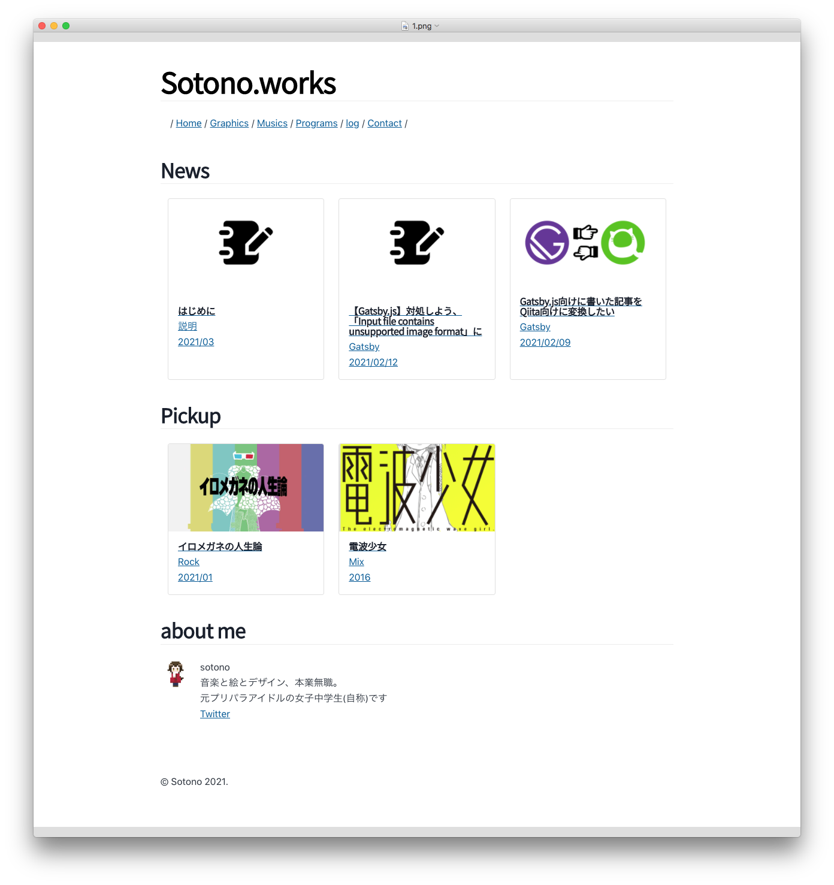

# この記事でやること

- 自分語り
- Homebrew 導入
- Xcode 導入
- Node.js 導入
- GatsbyCLI 導入

## あらすじ

どうも、JS 歴ゼロ秒だった、自称 JC です。
普段はプログラムも含めて、音楽を歌ったり、絵を書いたり  
創作活動を行っている僕です。

普段作っているブツは、  
Tumblr や forio などのポートフォリオサービスなどを使って  
ログとして残してあるのですが、

ふと Twitter を見ていたらこんなツイートが流れてきました。

<blockquote class="twitter-tweet"><p lang="ja" dir="ltr">駆け出しでお仕事募集中の絵描きはTwitterに投稿する前にHP整備したほうがいいですよ。pixivとかポートフォリオサイトじゃなくて、独自ドメインの自分のHPがあるって、「こいつまともに絵でビジネスしてそう…」って思わせる効果があるんですよ。</p>&mdash; よー清水🐧 YoShimizu (@you629) <a href="https://twitter.com/you629/status/1321295824010268674?ref_src=twsrc%5Etfw">October 28, 2020</a></blockquote>

**_いいこと言うじゃん…_**

まあ僕も作品のジャンルバラバラだったり、  
ポートフォリオサイトだと困るなーってところがあったりしていたので、  
自分のホームページを作りたいなーと思っていたのでした。

そんな中、ふと Qiita を見ているとこんな記事が話題になっていました。

[ボカロ P になったし、爆速ホームページを作る！ \- Qiita](https://qiita.com/KazukiSadasue/items/cf0d1d5b711a78bcd051)

爆速という魅惑的な単語に惹かれ、少し調べてみると、  
僕の思い描いていたカスタマイズが施せることがわかってきました。

**よし！オラも Gatsby で爆速ホームページ作っちゃうぞ！！**

## で　き　ま　し　た

できたものがこちらになります。



[実際のページはこちらから](https://stoic-chandrasekhar-069fbd.netlify.app/)

僕は極力シンプルなのが好きなのでこんな感じになりました。  
いかがだったでしょうか、それではまたお会いしましょう。  
ではでは…**で終わるわけあるか！！**

## というわけで始まります、Gatsby でホームページ作り。

- プログラミング？if とかならまあわかるけど…
- JavaScript？そんな名前の言語知らない！！

な僕でも簡単に~~四苦八苦して~~  
自前のポートフォリオサイトを作ることができたので、  
本記事もそういう人向けに記述していきます。

ちなみに僕はシンプルなのが好きなので、
装飾などは特に施さずにやっていきます。

## …そもそも Gatsby って何？

- JavaScript と HTML で構成されたフレームワーク
- 画像の最適化とビルドによる**表示速度の最適化**
- プラグインが豊富で制作のサポートも充実
- **Markdown でブログを作ることができたりする**

みたいな感じ。  
詳しく知りたい人はググってね。

## Gatsby でブログを作るまでの手順

僕の PC が Mac なので Mac での手順を記載します。  
Windows とかの人は各自「Gatsby 導入」とかでググってください。

### Homebrew からの Gatsby 導入

#### `Homebrew`と`Xcode`をインストールする

1.  [macOS（または Linux）用パッケージマネージャー — Homebrew](https://brew.sh/index_ja)  
     より、Homebrew というパッケージマネージャーをインストールします。  
     これは、要するに「Mac でなんやかんやを自動で管理してくれる便利なやつ」です。  
    [Homebrew のインストール \- Qiita](https://qiita.com/zaburo/items/29fe23c1ceb6056109fd)  
    を参考にしながら導入していきましょう。

2.  `Xcode`を導入します。  
    これは、要するに「Mac で開発するときに使うツール」です。  
    ないと`Homebrew`から怒られちゃうので導入しておきましょう。

```zsh
# 1.
# コマンド省略
$ ~

# 2.
$ xcode-select --install

```

#### `Node.js`をインストールする

1. `Homebrew`で`Node.js`をインストールします。  
   これは、要するに「Java という言語を実行できる環境を構築するやつ」です。  
   もっと噛み砕くと「サッカーで言うところのサッカーボール」です。  
   これがないと`Gatsby`を動かせないので導入します。

```zsh
# 1.
$ brew install node
```

#### `Git`をインストールする

1. `Git`をインストールします。  
   これは、要するに「好きなところでセーブできるセーブポイント」です。  
   セーブしなくても俺は突き進むぜ！って人がいたらごめんなさい、  
   **これがないと`Gatsby`を世に公開することができません。**  
   「セーブしたところを世に公開するツール」でもあるのです。  
   入れましょう。

2. `Git`を使用するには、名前とメールアドレスが必要です。  
   正しいかどうかわかりませんが、僕は名前を Sotono にしています。
   本当は本名入れたほうがいいと思うけど、嫌ならいいと思います…

```zsh
# 1.
brew install git

# 2.
git config --global user.name "Taro Yamada"
git config --global user.email "taro@gmail.com"

```

#### `Gatsby`を導入する

1. おまたせしました、ようやく Gatsby を導入します。  
   Gatsby の使用には`Gatsby-CLI`というものが必要となるので、
   これを`Node.js`でインストールします。

```zsh
# 1.
npm install -g gatsby-cli
```

## 次回

次回から Gatsby いじりを開始していきます。
