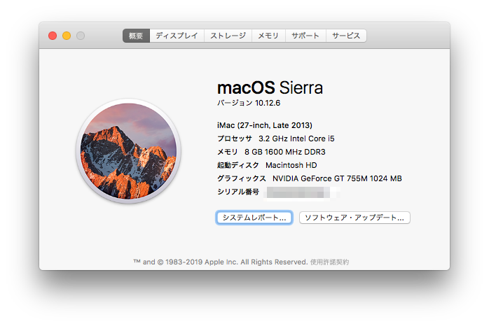
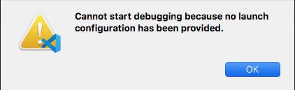
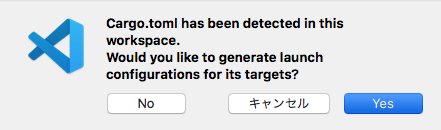

# 概要

- Python ﾁｮｯﾄﾜｶﾙマンが
- 「Rust ってロゴもサイトもかっこよいから面白そう」と思い
- OS Sierra のせいでインストールに頓挫しつつも
- Rust をゼロから触って
- VScode でデバッグをキメて
- Hello World するまでの話

Rust 入門とかいう n 番煎じな記事です。  
本当、門に入るレベルなのでご容赦を。

# Rust のインストール

**で、躓きました。**

```zsh:title=console
$ curl --proto '=https' --tlsv1.2 -sSf https://sh.rustup.rs | sh
```

を最初に試しましたが、OS のバージョンが古すぎる！と怒られました。



Logic9 とかいう化石を使うためにわざとバージョン落としているので、  
古いからだめかー…と諦めていたところ、  
同じような状況で戦っていていた人の記録があったので、  
それを参考にインストールしてみたら、通りました。

```zsh:title=console
$ curl https://sh.rustup.rs -sSf | sh -s -- --help

$ cargo --version
cargo 1.50.0 (f04e7fab7 2021-02-04)

$ rustc --version
rustc 1.50.0 (cb75ad5db 2021-02-10)

$ rustup --version
rustup 1.23.1 (3df2264a9 2020-11-30)

```

- 参考:[Rust インストール奮闘記\(言うほど奮闘はしていない\) \- Qiita](https://qiita.com/tommy_aka_jps/items/9dfea6eca46e70ec7b2c)

# プロジェクトの作成

なにはともあれ、プロジェクトを作成しましょう。  
Python はファイル一つで完結できる方法を知っているのですが、  
Rust は知らないので、おとなしく手順を踏んでプロジェクトを作成します。

```zsh:title=console
$ cargo new hello --bin
$ cd hello
$ tree
.
├── Cargo.lock
├── Cargo.toml
├── src
│   └── main.rs
└── target
    ├── CACHEDIR.TAG
    └── rls
        ├── CACHEDIR.TAG
        └── debug
            ├── build
            ├── deps
            │   ├── hello-76feb4ce3499974c.d
            │   ├── hello-86d258b864f270e1.d
            │   ├── libhello-76feb4ce3499974c.rmeta
            │   ├── libhello-86d258b864f270e1.rmeta
            │   └── save-analysis
            │       ├── hello-76feb4ce3499974c.json
            │       └── hello-86d258b864f270e1.json
            ├── examples
            └── incremental
                ├── hello-27d20vfgw3w3a
                │   ├── s-fvxh8t242p-kdjyar-b2rmmlvckmyu
                │   │   ├── dep-graph.bin
                │   │   ├── query-cache.bin
                │   │   └── work-products.bin
                │   └── s-fvxh8t242p-kdjyar.lock
                └── hello-2v337gk94ucz4
                    ├── s-fvxh8t2nyf-1xpfnvz-2atsjlik91zz
                    │   ├── dep-graph.bin
                    │   ├── query-cache.bin
                    │   └── work-products.bin
                    └── s-fvxh8t2nyf-1xpfnvz.lock
```

# Hello world をターミナルからキメにいく

[Rust 入門 \- とほほの WWW 入門](http://www.tohoho-web.com/ex/rust.html) を見ていくと、  
どうやら `cargo run` とすると Hello World できるみたいですので、早速やっていきます。

```zsh:title=console
$ cargo run
Finished dev [unoptimized + debuginfo] target(s) in 0.09s
     Running `target/debug/hello`
Hello, world!
```

できた。

# VSCode のデバッグからキメにいく

デバッグのたびにいちいち`cargo run` するのは少々面倒なので、  
愛用エディターの VSCode でデバッグできるようにしましょう。

## 拡張機能のインストール

調べると、以下の拡張機能が必要とのことなのでインストールします。

- [Rust](https://marketplace.visualstudio.com/items?itemName=rust-lang.rust)

コードの保管や色付けをするやつ。

- [CodeLLDB](https://marketplace.visualstudio.com/items?itemName=vadimcn.vscode-lldb)

~~よくわからないけどとにかく~~Rust をちゃんとデバッグできるやつ。

## さあ F5 を押してデバッグ



> 訳: _起動構成が提供されていないため、デバッグを開始できません。_

まあ`launch.json` 設定してないし、OK しか押せないので OK



> 訳:_このワークスペースで Cargo.toml が検出されました。 ターゲットの起動構成を生成しますか？_

**No を押した世界線の僕**はデバッグできなかったらしいので、  
Yes を選択します。  
すると、自動的に`launch.json` が設定されます。

```json
{
  // IntelliSense を使用して利用可能な属性を学べます。
  // 既存の属性の説明をホバーして表示します。
  // 詳細情報は次を確認してください: https://go.microsoft.com/fwlink/?linkid=830387
  "version": "0.2.0",
  "configurations": [
    {
      "type": "lldb",
      "request": "launch",
      "name": "Debug executable 'hello'",
      "cargo": {
        "args": ["build", "--bin=hello", "--package=hello"],
        "filter": {
          "name": "hello",
          "kind": "bin"
        }
      },
      "args": [],
      "cwd": "${workspaceFolder}"
    },
    {
      "type": "lldb",
      "request": "launch",
      "name": "Debug unit tests in executable 'hello'",
      "cargo": {
        "args": ["test", "--no-run", "--bin=hello", "--package=hello"],
        "filter": {
          "name": "hello",
          "kind": "bin"
        }
      },
      "args": [],
      "cwd": "${workspaceFolder}"
    }
  ]
}
```

ということで改めて F5 でデバッグをキメると  
`Hello, world!` と表示され、本日は勝利です。

対戦ありがとうございました。  
明日から楽しませていただきます。

## 参考

- [Visual Studio Code で Rust 開発環境を整える \- Qiita](https://qiita.com/84zume/items/377033ab6b6aee2a68d7)
